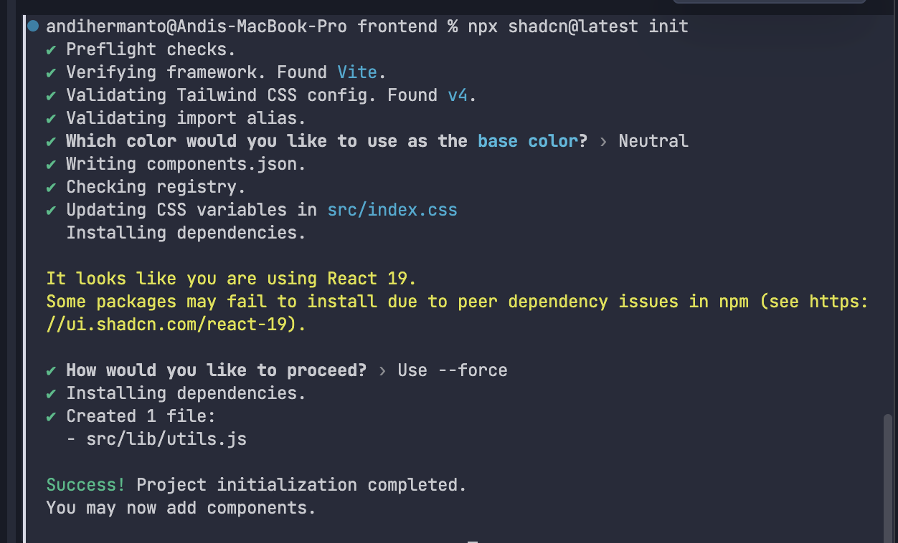

# Configure Shadcn/UI

After installing reactjs using viteJs.


#### Create project <a href="#create-project" id="create-project"></a>

Start by creating a new React project using `vite`. Select the **React + TypeScript** template:

pnpmnpmyarnbun

```
npm create vite@latest
```

#### Add Tailwind CSS <a href="#add-tailwind-css" id="add-tailwind-css"></a>

pnpmnpmyarnbun

```
npm install tailwindcss @tailwindcss/vite
```

Replace everything in `src/index.css` with the following:

src/index.css

```
@import "tailwindcss";
```

#### Create a new file  jsconfig.json, insert code in bellow: <a href="#edit-tsconfigjson-file" id="edit-tsconfigjson-file"></a>

```
{
    "compilerOptions": {
      "baseUrl": ".",
      "paths": {
        "@/*": ["./src/*"]
      }
    }
  }
```

After settings up these configurations, you can run shadcn-ui initialization command again.

<figure><figcaption></figcaption></figure>

After successful,  you can install command like this

```
npx shadcn@latest add form input button
```

<figure><figcaption></figcaption></figure>
